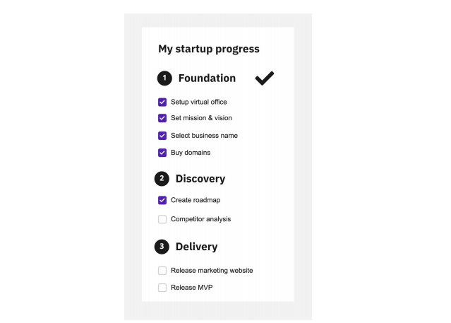

## Test assignment

Every startup goes through several stages. In every stage, there are necessary steps to be accomplished.

Create a simple application that documents this progress.

### Your timeline:

This task should take approximately 120 minutes to complete. The assignment is vague on purpose and it’s up to you what technologies and approaches you use.

### Requirements:

- Every phase can have an unlimited amount of tasks
- If the startup accomplishes all tasks in the phase, it’s marked as done and unlocks the next phase.
- Tasks cannot be marked as completed unless all tasks in the previous phase were completed.
- Implement in React
- Store the progress in local storage
- When all phases are completed, display a random fact from https://uselessfacts.jsph.pl/random.json

## What has been done

- used React, TypeScript and TailWind CSS - the stack I love
- added mobile layout
- added a button to reset the app after completing all the steps
- deployed the app to GitHub Pages https://vb-oiko.github.io/startup-progress-test/
